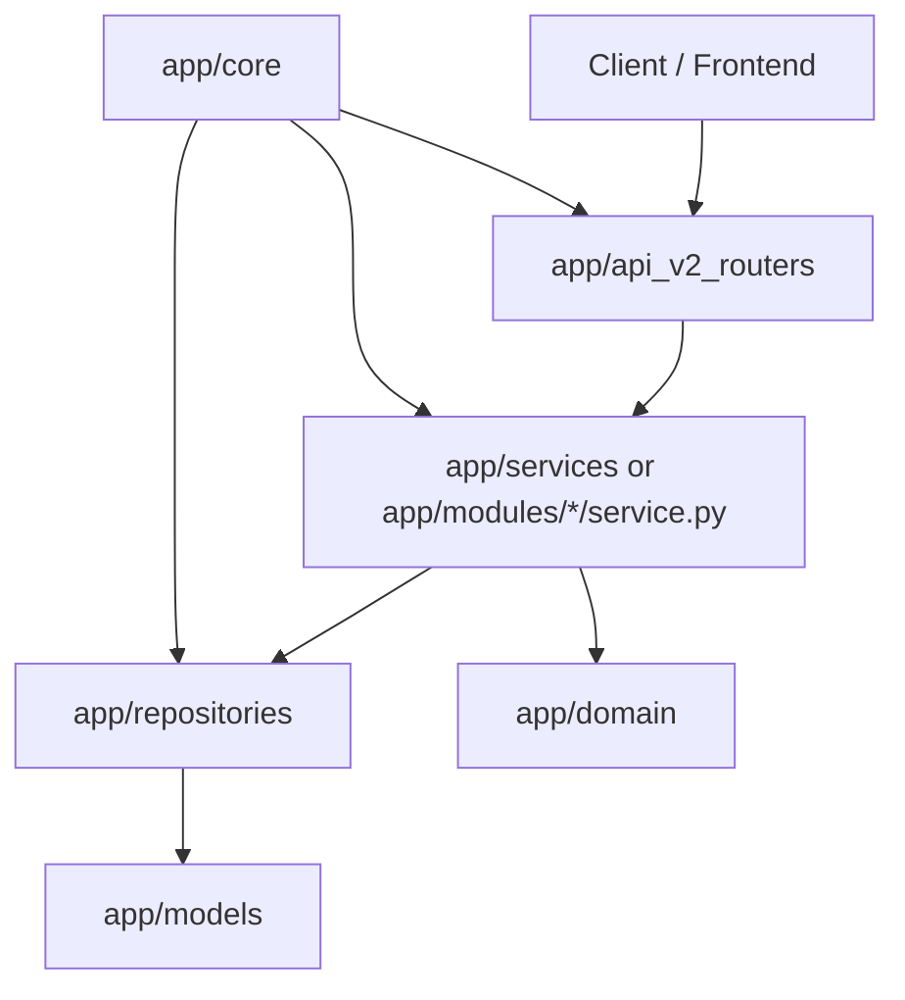
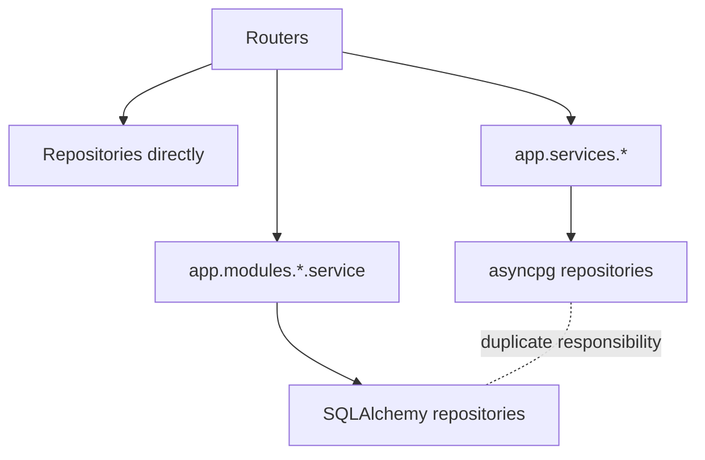

# EduBoost V2 Core Technical Audit

**Date:** 2026-05-17  
**Repository audited:** `/home/nkgolol/Dev/SandBox/dev/Eduboost-V2`  
**Branch:** `codex/production_readiness`  
**Commit:** `a415119`  
**Audit focus:** `app/core`, `app/domain`, `app/models`, `app/modules`, `app/repositories`, `app/services`, `app/api_v2_routers`, runtime boundaries, authorization, POPIA flows, diagnostics, lessons, background jobs, validation and maintainability.

## Executive Summary

The corrected EduBoost V2 repository is materially healthier than the first path that was inspected. The core backend compiles, the active FastAPI runtime is coherent enough for targeted tests to import, and the codebase has clear architectural intent: FastAPI v2 routers, SQLAlchemy models, Redis-backed token revocation, POPIA-first design, audit logging, modular monolith ADRs and import-linter contracts.

However, the production readiness posture is not yet acceptable for a learner data platform. The dominant risks are not syntax-level defects. They are boundary erosion, duplicated runtime paths, inconsistent repository/service implementations, and authorization or consent enforcement that is strong on some create paths but absent on read, sync, refresh and lifecycle paths.

The most serious findings are:

1. POPIA consent lifecycle endpoints are wired to the wrong service/repository family and can fail at runtime.
2. Consent lifecycle routes use generated actor UUIDs and currently do not enforce the intended learner authorization dependency.
3. Lesson read, completion and sync routes trust caller-provided lesson IDs and do not verify learner ownership or active consent.
4. Authentication business logic lives in the router, directly uses repositories, stores `email_encrypted` as submitted email, and produces inconsistent learner authorization claims.
5. Diagnostics session scoring can corrupt adaptive state because historical responses are paired with the current item and item/session binding is weak.
6. The architecture contracts in `.importlinter` are directionally correct but are currently violated across many routers.
7. There are duplicate services and repositories for the same concepts, including consent, auth, diagnostics, lessons, learners and audit events.
8. Background job execution is split between an in-process FastAPI job helper and ARQ, and at least one ARQ consent job is currently misconstructed.

This report should be treated as a lead-developer audit, not just a bug list. The core recommendation is to define one canonical runtime stack per domain slice, enforce it with import-linter in CI, and repair authorization/consent at the service boundary so routers cannot accidentally bypass it.

## Scope and Inventory

Audited Python surface in the core runtime areas:

| Area | Files | Lines |
| --- | ---: | ---: |
| `app/core` | 33 | 4,605 |
| `app/domain` | 11 | 1,169 |
| `app/models` | 3 | 986 |
| `app/modules` | 79 | 15,420 |
| `app/repositories` | 17 | 2,242 |
| `app/services` | 64 | 6,610 |
| `app/api_v2_routers` | 23 | 2,654 |
| **Total audited Python files** | **230** | **33,456** |

The active application entrypoint is `app/api_v2.py`. It builds the FastAPI app, registers the v2 routers under both `/api/v2` and `/v2`, and runs lifespan tasks for consent expiry and optional Key Vault rotation.

The repository includes top-level untracked empty directories named `application`, `models`, `repositories` and `shared`. They are not part of the active runtime and should either be removed or intentionally documented as future scaffolding.

## Validation Results

Commands run from `/home/nkgolol/Dev/SandBox/dev/Eduboost-V2`:

```bash
python3 -m compileall -q app/core app/domain app/models app/modules app/repositories app/services app/api_v2_routers
```

Result: **passed** with exit code `0`.

```bash
python3 -m pytest tests/unit/test_api_v2_router_contract.py tests/unit/test_authorization_policy.py tests/unit/modules/diagnostics/test_session_lifecycle.py -q --tb=short
```

Result: **8 tests passed**, but the command exited non-zero because the global coverage gate failed:

```text
ERROR: Coverage failure: total of 25 is less than fail-under=80
TOTAL coverage: 24.64%
```

Tooling availability in the active WSL Python:

| Tool | Status |
| --- | --- |
| `pytest` | installed, version 9.0.3 |
| `ruff` | not installed |
| `mypy` | not installed |
| `import-linter` | not installed |

This matters because the repository has architecture contracts but the local environment cannot currently enforce them.

## Architectural Read

The intended architecture is strong and worth preserving:



The actual architecture frequently short-circuits this model:



The problem is not merely style. The duplicate stacks have different method names, transaction expectations, data model assumptions and audit APIs. That leads directly to runtime mismatches in POPIA consent flows and background jobs.

## Findings

### P0: POPIA Consent Lifecycle Is Wired to Incompatible Runtime Components

**Files:**

- `app/api_v2_routers/popia.py`
- `app/services/consent_service.py`
- `app/modules/consent/service.py`
- `app/repositories/repositories.py`
- `app/repositories/consent_repository.py`

The POPIA router imports `ConsentService` from `app.services.consent_service`, then injects SQLAlchemy aggregate repositories from `app.repositories.repositories`:

- `app/api_v2_routers/popia.py:27`
- `app/api_v2_routers/popia.py:38`
- `app/api_v2_routers/popia.py:41-42`

That service expects the asyncpg-style consent repository from `app.repositories.consent_repository`, with methods such as `get_active_for_learner`, and an audit repository with a `record` method:

- `app/services/consent_service.py:20-21`
- `app/services/consent_service.py:49`
- `app/services/consent_service.py:62-71`
- `app/services/consent_service.py:86`

The SQLAlchemy aggregate consent repository instead exposes methods such as `get_active`, `get_latest_for_learner`, `grant`, `revoke` and `renew`. The aggregate audit repository exposes `log`, not `record`.

**Impact:** Consent lifecycle endpoints can fail at runtime once exercised. Worse, the failure is in a POPIA-critical path, so it undermines one of the system's primary compliance claims.

**Recommendation:** Pick one runtime consent service for FastAPI v2. The likely canonical path is `app/modules/consent/service.py` because it matches the SQLAlchemy session model used by current routers. Then update POPIA routes to depend on a single service factory and remove or archive the incompatible `app/services/consent_service.py` path once migration is complete.

### P0: POPIA Consent Lifecycle Routes Do Not Enforce Real Actor Identity or Learner Authorization

**File:** `app/api_v2_routers/popia.py`

The lifecycle routes use generated actor IDs instead of the authenticated principal:

- `grant_consent`: `Depends(lambda: uuid.uuid4())`
- `revoke_consent`: `Depends(lambda: uuid.uuid4())`
- `renew_consent`: `Depends(lambda: uuid.uuid4())`
- `erase_data`: `Depends(lambda: uuid.uuid4())`

The route comments indicate the intended dependency is `require_learner_write_for_current_user`, but it is not actually applied on the consent lifecycle endpoints.

**Impact:** Audit trails will contain non-user actor IDs. Consent operations may be impossible to attribute, and authorization enforcement is weaker than the surrounding code and documentation imply.

**Recommendation:** Replace generated actor dependencies with `get_current_user` plus `require_learner_write_for_current_user` or an equivalent guardian/teacher authorization dependency. Add tests proving an unrelated guardian cannot grant, revoke, renew or erase consent for another learner.

### P0: Lesson Read, Completion and Sync Routes Trust Caller-Supplied Lesson IDs

**File:** `app/api_v2_routers/lessons.py`

Lesson generation is relatively well protected: it loads learner ownership and checks active consent before generation.

The later routes do not maintain that protection:

- `get_lesson` fetches by lesson ID and explicitly states it trusts the ID to be known only to an authorized user.
- `complete_lesson` mutates by lesson ID without learner ownership validation.
- `sync_lessons` loops over arbitrary submitted lesson IDs and applies completion or feedback without object authorization.

**Impact:** A user who obtains or guesses a lesson ID may read, complete or attach feedback to a lesson outside their learner scope. This is both a privacy risk and data integrity risk.

**Recommendation:** Make lesson repository reads return lesson plus learner ID, then enforce `require_learner_read_for_current_user` or `require_learner_write_for_current_user` before returning or mutating. Sync should reject mixed-learner payloads and validate each event against the authenticated user's learner scope.

### P0: Authentication Logic Is in the Router and Handles Sensitive Data Incorrectly

**File:** `app/api_v2_routers/auth.py`

The auth router imports repositories directly and performs registration, login, refresh, dev-session, logout and revoke-all logic inline. During registration it sets `email_encrypted=submitted_email`, meaning a field named and modeled as encrypted receives the raw submitted email.

The router also creates access tokens inconsistently:

- Register and login tokens include `sub`, `role` and `email_hash`.
- Dev-session tokens include `guardian_learner_ids`.
- Refresh tokens produce new access tokens without restoring `guardian_learner_ids`.

`require_learner_write_for_current_user` relies on the `guardian_learner_ids` claim for guardian write access, so refreshed guardian tokens can lose authorization context.

**Impact:** Sensitive data handling is not aligned with the schema and POPIA posture. Authorization behavior can change after token refresh. Auth remains harder to test and reason about because the business logic is embedded in route handlers.

**Recommendation:** Move auth logic into a canonical `AuthService` that owns email hashing/encryption, token claim construction, refresh rotation and audit events. Build access-token claims from persisted learner relationships on every login and refresh, or modify the authorization dependency to load relationship state server-side instead of trusting claims.

### P1: Import-Linter Contracts Exist but Are Violated by Runtime Routers

**Files:** `.importlinter`, `app/api_v2_routers/*`

The repository has the right intent in `.importlinter`: routers should not import repositories directly, services should not import routers, repositories should not import services/modules and domain should not import infrastructure.

Current direct router-to-repository imports include:

- `app/api_v2_routers/auth.py`
- `app/api_v2_routers/parents.py`
- `app/api_v2_routers/diagnostics.py`
- `app/api_v2_routers/gamification.py`
- `app/api_v2_routers/study_plans.py`
- `app/api_v2_routers/learners.py`
- `app/api_v2_routers/popia.py`
- `app/api_v2_routers/onboarding.py`
- `app/api_v2_routers/consent.py`

**Impact:** The architecture contract is aspirational rather than enforced. Routers become transaction owners, authorization owners and business logic owners, increasing regression risk.

**Recommendation:** Install import-linter in the dev/test environment and put it in CI as a required gate. Migrate routers incrementally, starting with POPIA, auth, lessons and diagnostics.

### P1: Duplicate Services and Repositories Create Runtime Ambiguity

Duplicate classes found in the core audit surface:

| Concept | Duplicate locations |
| --- | --- |
| `AuthService` | `app/modules/auth/service.py`, `app/services/auth_service.py` |
| `ConsentService` | `app/modules/consent/service.py`, `app/services/consent_service.py`, `app/modules/diagnostics/service.py` |
| `ConsentRepository` | `app/repositories/repositories.py`, `app/repositories/consent_repository.py` |
| `AuditRepository` | `app/repositories/repositories.py`, `app/repositories/audit_repository.py` |
| `GuardianRepository` | `app/repositories/repositories.py`, `app/repositories/auth_repository.py` |
| `LearnerRepository` | `app/repositories/repositories.py`, `app/repositories/learner_repository.py` |
| `DiagnosticRepository` | `app/repositories/repositories.py`, `app/repositories/diagnostic_repository.py` |
| `DiagnosticSessionService` | `app/modules/diagnostics/diagnostic_session_service.py`, `app/services/diagnostic_session_service.py` |
| `LessonRepository` | `app/repositories/repositories.py`, `app/repositories/lesson_repository.py` |
| `StripeService` | `app/core/stripe_client.py`, `app/services/stripe_service.py` |

**Impact:** Developers cannot reliably know which implementation is canonical. Bugs emerge when SQLAlchemy routers inject aggregate repositories into asyncpg services, or when background jobs instantiate repository classes with the wrong constructor.

**Recommendation:** Create a runtime ownership matrix. For each domain, select one canonical service and repository implementation, mark the others as deprecated, then remove or archive them after call sites are migrated.

### P1: Diagnostic Adaptive Session State Can Be Corrupted

**Files:**

- `app/api_v2_routers/diagnostics.py`
- `app/modules/diagnostics/diagnostic_session_service.py`
- `app/modules/diagnostics/irt_engine.py`

The adaptive session flow has several integrity weaknesses:

1. `next_item` accepts a `caps_ref` query parameter and does not verify it matches the session snapshot.
2. `respond` accepts an item ID without proving the item was served in that session.
3. `submit_response` reconstructs historical responses by pairing every stored response with the current item object.
4. Earlier response history is eventually represented with generic `_ItemProxy` parameters in the IRT engine.
5. Batch diagnostic submission loads grade-level items and scores against a default administered set rather than strictly against the items presented to the learner.

**Impact:** Theta updates, mastery state and gap detection can become inaccurate. This directly affects learning recommendations, parent dashboards and any downstream analytics.

**Recommendation:** Store item IDs with every response, validate item membership against `served_item_ids`, bind session subject/grade/CAPS metadata server-side, and pass the actual item parameter history into the IRT update. Add a test where answering an unserved item is rejected and a test where multi-item history updates theta using each original item.

### P1: Transaction Boundaries Are Mixed Between Request Dependency and Services

**Files:**

- `app/core/database.py`
- `app/modules/lessons/service.py`
- multiple repositories/services

`get_db` commits automatically at the end of a successful request. Several services also call `commit()` internally. That means a single request can partially commit before later work fails, and service methods become harder to compose safely.

**Impact:** Partial writes are more likely in multi-step workflows such as lesson generation, diagnostics submission, erasure and consent changes.

**Recommendation:** Adopt one convention: either request-scoped unit of work commits once, or services own explicit transactions. For this app, a request-scoped unit of work plus explicit service-level flushes is likely cleaner. Reserve internal commits for background jobs or explicitly documented isolated operations.

### P1: Background Jobs Are Split and One ARQ Consent Job Is Broken

**Files:**

- `app/core/jobs.py`
- `app/modules/jobs.py`

There are two job mechanisms:

1. `app/core/jobs.py` uses FastAPI `BackgroundTasks`, in-memory tracking and optional Redis metadata.
2. `app/modules/jobs.py` defines ARQ workers and cron jobs.

The ARQ consent reminder job constructs `ConsentService()` with no database session or repository even though the SQLAlchemy consent service constructor requires a DB session or repository. The renewal email helper also uses lower-case config attributes such as `sendgrid_api_key`, while the settings model appears to predominantly expose upper-case environment-backed names.

**Impact:** Scheduled consent renewal reminders can fail at runtime. Job observability is fragmented, and critical background workflows are not durable when routed through FastAPI background tasks.

**Recommendation:** Standardize on ARQ for durable jobs. Keep FastAPI background tasks only for non-critical request-adjacent work. Fix the ARQ worker context to create a session, instantiate canonical services correctly, and add a unit test for each registered job function with a fake DB/service dependency.

### P1: Parent Dashboard Has N+1 Queries and Per-Learner AI Calls

**File:** `app/api_v2_routers/parents.py`

The parent dashboard loops over learners and performs multiple queries per learner for lessons, gaps, diagnostic sessions and counts. The trust dashboard also calls the executive service per learner.

**Impact:** Dashboard latency will degrade linearly with household size and data history. If the executive service invokes an LLM or heavy summarizer, this route can become expensive and unpredictable.

**Recommendation:** Add dashboard-specific repository methods that fetch counts and latest activity in grouped queries. Cache or precompute progress summaries, and make AI-generated summaries asynchronous or explicitly opt-in.

### P1: Authorization Helper Contains a Duplicate Function Definition

**File:** `app/core/authorization.py`

`assert_can_access_learner` is defined once with richer logic and later redefined as a wrapper around `can_access_learner`. The second definition overrides the first.

**Impact:** This is easy to miss during review and can invalidate assumptions about which authorization path is active. It is currently masked by Python import behavior.

**Recommendation:** Remove the duplicate definition, add tests that pin the expected behavior, and enable a lint rule that catches redefinition.

### P2: Health Checks Are Useful but Sequential and Configuration Checks Are Minimal

**File:** `app/core/health.py`

The deep health check is well structured and sanitizes exception details to class names. It checks secrets, Postgres, Redis, migrations, audit repository, LLM provider and judiciary.

Improvements:

- Run independent checks concurrently with `asyncio.gather` to reduce readiness latency.
- Validate placeholder or known-weak secret values, not just presence.
- Make optional provider checks configurable so readiness does not perform avoidable external calls in restricted environments.

### P2: Lifespan Cancellation Does Not Await Cancelled Tasks

**File:** `app/api_v2.py`

The lifespan function starts recurring consent expiry and optional Key Vault rotation tasks, then cancels them during shutdown. It does not await the cancelled tasks with `contextlib.suppress(asyncio.CancelledError)`.

**Impact:** Shutdown may leave noisy cancelled-task logs or incomplete cleanup.

**Recommendation:** Gather and await cancelled tasks during shutdown.

### P2: Repository Methods Leave Simple Query Performance on the Table

**File:** `app/repositories/repositories.py`

`LearnerRepository.count_lessons` selects lesson IDs and returns `len(rows)` instead of using SQL `COUNT`. Similar dashboard-style patterns appear elsewhere.

**Impact:** This is acceptable for small data but becomes unnecessary load as learner activity grows.

**Recommendation:** Replace count-by-select patterns with aggregate queries and create dashboard-specific read models.

### P2: Lesson Provider Metadata Is Misleading on Fallback

**File:** `app/modules/lessons/service.py`

The generated lesson record sets provider metadata to `cache` on cache hit and `groq` otherwise, even though the runtime has provider fallback behavior and can use Anthropic or other providers.

**Impact:** Audit and observability data can misrepresent which provider generated learner-facing content.

**Recommendation:** Return provider identity from the LLM gateway and persist the actual provider used.

### P2: Development Slow Query Endpoint Returns Raw Exception Strings

**File:** `app/api_v2.py`

The development-only slow query endpoint catches broad exceptions and returns `str(exc)` in the response.

**Impact:** This is gated to development, but the pattern should not be copied into production endpoints.

**Recommendation:** Keep it dev-only, or sanitize error details consistently.

## Domain-Specific Assessment

### Auth and Identity

Strengths:

- Password policy validation is centralized in the request schema.
- Login failure emits an audit event.
- Refresh tokens are persisted and can be revoked.
- Refresh cookie is configured as `httponly`, `secure`, `samesite=lax` and scoped to `/api/v2/auth`.

Risks:

- Auth business logic is router-owned.
- Email encryption semantics appear broken during registration.
- Access token claims are inconsistent between register, login, dev-session and refresh.
- Role is accepted from registration input, currently limited to `parent` and `teacher`; business rules should confirm whether public teacher registration is allowed.

### POPIA, Consent and Data Rights

Strengths:

- There is clear design intent and extensive documentation.
- Data export and erasure services load learners and perform authorization checks in `POPIADataRightsService`.
- Audit events are considered throughout.

Risks:

- Consent lifecycle routes are wired to incompatible services.
- Actor identity is generated instead of authenticated.
- There are multiple consent services with incompatible repository expectations.
- Erasure behavior appears immediate in some paths while route names imply request workflow, which needs product/legal confirmation.

### Lessons

Strengths:

- Generation path checks learner write access and active consent.
- The service has caching, AI gateway integration and content safety hooks.

Risks:

- Read, complete and sync routes lack object authorization.
- Service methods mutate by lesson ID without ownership context.
- Provider metadata can be wrong.
- Service commits internally despite request-level commits.

### Diagnostics

Strengths:

- There is meaningful domain logic for IRT, mastery updates, gaps and adaptive sessions.
- Start/recover/next routes include authorization and consent gates.

Risks:

- Item/session binding is insufficient.
- Historical responses are not associated with original item parameters.
- Batch scoring can treat omitted or unserved items as incorrect.
- Repository imports occur directly in the router.

### Parent Dashboard

Strengths:

- The dashboard aggregates the right product concepts: learners, lessons, gaps, diagnostics, consent and exports.
- There is an attempt to expose trust-centered state.

Risks:

- N+1 data access.
- Export URLs do not appear to match the actual POPIA route structure.
- Erasure endpoint overlaps with POPIA service behavior and uses a no-op background purge logger.

### Core Infrastructure

Strengths:

- Runtime health checks are thoughtful and sanitize exception detail.
- Redis token revocation and audit repository checks exist.
- Database module provides a consistent async SQLAlchemy session dependency.

Risks:

- NullPool in dev/test can hide pool behavior until production.
- Request-level auto-commit plus service-level commits makes transaction semantics inconsistent.
- Lifespan tasks should be awaited on cancellation.

## Recommended Remediation Roadmap

### Phase 0: Stabilize Compliance and Authorization

1. Fix POPIA consent lifecycle wiring to use the canonical SQLAlchemy consent service.
2. Replace generated actor UUIDs with authenticated user identity.
3. Enforce learner write authorization on consent grant, revoke, renew and erase.
4. Add authorization and active-consent checks to lesson read, complete and sync.
5. Repair auth token claim construction after register, login and refresh.
6. Stop writing raw email into `email_encrypted`; use the canonical PII encryption/hash helpers.

Exit criteria:

- Tests prove unrelated guardians cannot access, mutate or consent for other learners.
- Register, login and refresh produce equivalent authorization behavior.
- POPIA lifecycle endpoints run against the same repository family as the rest of FastAPI v2.

### Phase 1: Consolidate Runtime Boundaries

1. Install and enforce import-linter in CI.
2. Migrate routers away from direct repository imports.
3. Choose canonical implementations for auth, consent, diagnostics, lessons, learner and audit repositories.
4. Mark duplicate services/repositories as deprecated, then remove after call sites are migrated.
5. Remove duplicate `assert_can_access_learner` definition.

Exit criteria:

- Import-linter contracts pass locally and in CI.
- Each domain concept has one runtime service and one repository family.
- Routers only orchestrate HTTP concerns, dependencies and response models.

### Phase 2: Correct Learning State and Data Integrity

1. Persist diagnostic response history with item ID and item parameters.
2. Reject diagnostic responses for unserved items.
3. Bind adaptive sessions to server-side subject, grade and CAPS metadata.
4. Update batch diagnostic scoring to score only administered items.
5. Add invariant tests for theta updates and gap detection.

Exit criteria:

- Adaptive scoring is reproducible from persisted data.
- Session tampering tests fail closed.
- Parent dashboard learning metrics reflect validated diagnostic state.

### Phase 3: Performance, Jobs and Observability

1. Standardize durable jobs on ARQ and fix service construction in workers.
2. Replace parent dashboard N+1 reads with grouped queries.
3. Return and persist actual LLM provider metadata.
4. Run independent health checks concurrently.
5. Add smoke tests for every registered background job.

Exit criteria:

- Dashboard latency is stable across multiple learners.
- Consent reminder job can run in a test worker context.
- Provider and audit metadata match actual runtime behavior.

### Phase 4: Quality Gate Hardening

1. Add `ruff`, `mypy` or pyright, and import-linter to the local dev environment and CI.
2. Split unit coverage gates by package so targeted test runs are not blocked by global coverage unless intentionally running full suite.
3. Add contract tests for route authorization and consent behavior.
4. Add repository/service integration tests with a real test database migration state.
5. Add regression tests for duplicate class/function names in critical modules.

Exit criteria:

- Targeted unit tests can run without unrelated global coverage failure.
- Full CI enforces architecture, typing/linting and coverage gates.
- Critical privacy and authorization flows have explicit regression tests.

## Suggested Ownership Matrix

| Domain | Canonical owner to select | Immediate action |
| --- | --- | --- |
| Auth | `app/modules/auth/service.py` or `app/services/auth_service.py` | Pick one, move router logic there |
| Consent | `app/modules/consent/service.py` | Use for FastAPI v2 SQLAlchemy flows |
| POPIA data rights | `app/services/popia_service.py` | Keep, but align lifecycle routes with canonical consent service |
| Diagnostics | `app/modules/diagnostics/*` | Keep domain algorithms, fix session persistence/invariants |
| Lessons | `app/modules/lessons/service.py` | Keep, add ownership-aware methods |
| Audit | Dedicated `app/repositories/audit_repository.py` or aggregate repo | Pick one API: `log`, `append` or `record`, not all three |
| Jobs | `app/modules/jobs.py` ARQ | Use for durable work; limit in-process jobs |

## High-Value Tests to Add First

1. `test_popia_consent_grant_requires_authorized_guardian`
2. `test_popia_consent_service_uses_sqlalchemy_repository_contract`
3. `test_lesson_get_rejects_lesson_from_other_learner`
4. `test_lesson_sync_rejects_cross_learner_lesson_id`
5. `test_refresh_token_preserves_guardian_learner_authorization`
6. `test_register_encrypts_email_and_hashes_lookup_email`
7. `test_diagnostic_response_rejects_unserved_item`
8. `test_diagnostic_theta_uses_each_historical_item_parameters`
9. `test_arq_consent_reminder_constructs_service_with_db_session`
10. `test_import_linter_contracts_pass`

## Final Assessment

EduBoost V2 has the bones of a serious production system: clear FastAPI v2 entrypoint, POPIA-aware product thinking, audit concepts, modular domain folders, Redis integration, health checks and meaningful educational algorithms. The main issue is that implementation velocity has produced parallel service/repository stacks and route-level shortcuts that now compete with the intended architecture.

The highest-leverage path is not a broad rewrite. It is a focused consolidation: repair POPIA/auth/lesson authorization first, choose canonical service and repository paths, then enforce the boundaries the repository already documents. Once those are in place, the existing domain work becomes much easier to harden, test and scale.
