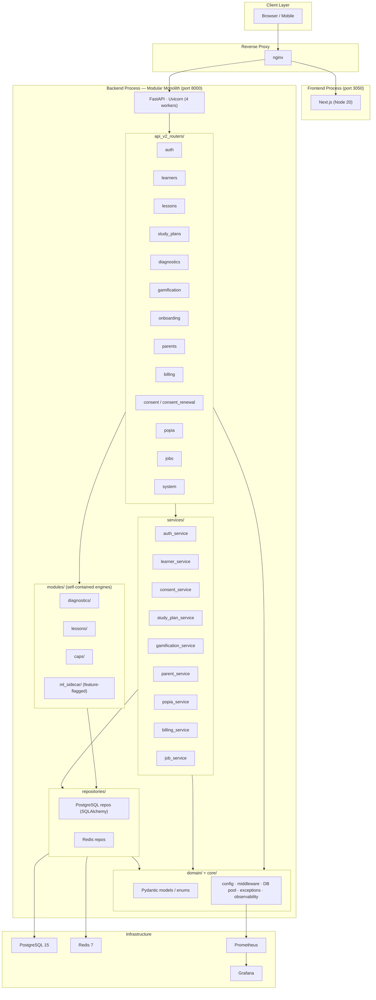
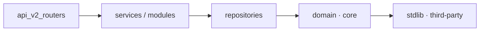

# EduBoost SA V2 — Architecture Diagram

> **Note:** This diagram is the authoritative visual reference for the V2
> modular-monolith topology. Update it whenever a new bounded context is added
> or infrastructure dependency changes.

---

## Runtime Topology

---

## Layered Dependency Direction

Arrows represent **allowed import direction** only. No upward imports permitted.

---

## Bounded Contexts

| Context | Router | Service | Module |
|---|---|---|---|
| auth | `auth.py` | `auth_service.py` | — |
| learners | `learners.py` | `learner_service.py` | — |
| consent | `consent.py`, `consent_renewal.py` | `consent_service.py` | — |
| diagnostics | `diagnostics.py` | — | `modules/diagnostics/` |
| lessons | `lessons.py` | — | `modules/lessons/` |
| study_plans | `study_plans.py` | `study_plan_service.py` | `modules/caps/` |
| gamification | `gamification.py` | `gamification_service.py` | — |
| parent_portal | `parents.py` | `parent_service.py` | — |
| popia | `popia.py` | `popia_service.py` | — |
| billing | `billing.py` | `billing_service.py` | — |
| jobs | `jobs.py` | `job_service.py` | — |
| observability | `system.py` | — | `core/observability.py` |

---

## Infrastructure Note

The inference ML sidecar (`modules/ml_sidecar/`) is:
- Loaded in-process via `requirements-ml.txt` extras.
- Gated behind feature flags — **not active in production today**.
- Not a separately deployed microservice. Any future extraction requires a new ADR.
