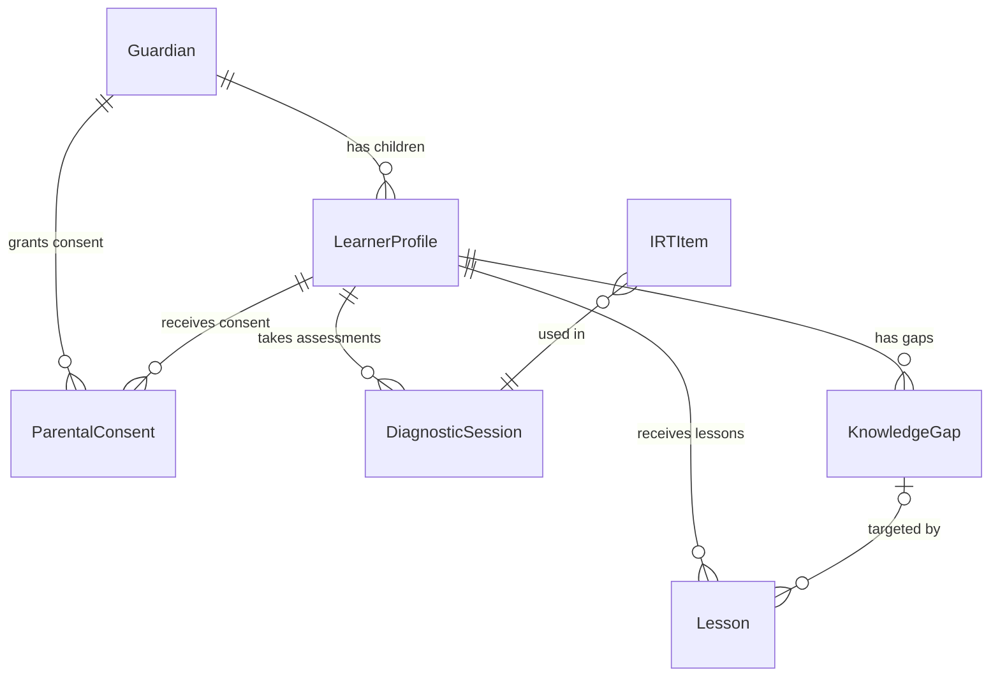

# EduBoost V2 — Comprehensive Technical Status Report

**Date**: 2026-05-05  
**Branch**: `codex/frontend-backend-recovery`  
**Latest Commit**: `2d3c77f — feat: complete remaining project phases`  
**Version**: Unreleased (post-`0.2.0-rc1`)

> **Historical snapshot notice:** This report is retained for engineering
> traceability only. It is not the current release-readiness source of truth.
> Current claims must be checked against [`docs/current_state.md`](docs/current_state.md)
> and the live backlog in [`TODO.md`](TODO.md). Treat statements in this file
> such as "mature pre-production", "complete", or "implemented and tested" as
> dated claims from the branch and commit above unless backed by fresh green
> evidence on the current commit.

---

## 1. Executive Summary

EduBoost V2 is an AI-powered adaptive learning platform targeting South African primary education (Grade R–7). The project has completed a major architectural migration from a five-pillar monolith to a **modular monolith**, built a functional **CAPS-aligned LLM training pipeline**, and stabilised the **frontend-backend integration** layer. The platform is POPIA-compliant by design and targets Azure Container Apps for production hosting in the South Africa North region.

### Key Metrics at a Glance

| Metric | Value |
|---|---|
| Python source files (`app/`) | 119 |
| Frontend source files (`.ts`/`.tsx`) | 39 |
| Backend test files (`test_*.py`) | 67 |
| E2E test specs (`.spec.ts`) | 4 |
| Alembic migrations | 8 (+ 2 merge heads) |
| CAPS PDFs scraped | 203 |
| CAPS text extractions | 194 |
| Teaching plan documents | 60 (Grades R–7) |
| Training data entries (with guardrails) | 29 |
| Books manifest entries | 9 |
| Coverage gate | ≥ 80% |

---

## 2. Architecture

### 2.1 Runtime Architecture

The application follows a **modular monolith** pattern with clearly separated layers:

```
app/
├── api_v2.py                 # FastAPI entrypoint (single process)
├── api_v2_routers/           # HTTP route handlers (23 router files)
│   ├── auth.py               # JWT auth, login, registration, token refresh
│   ├── learners.py           # Learner CRUD with RBAC + erasure
│   ├── lessons.py            # Lesson generation, streaming (SSE), completion
│   ├── diagnostics.py        # IRT-based adaptive assessments
│   ├── study_plans.py        # Study plan generation and retrieval
│   ├── gamification.py       # XP, badges, streaks
│   ├── consent.py            # POPIA consent grant/revoke
│   ├── parents.py            # Parent portal, PDF reports
│   ├── billing.py            # Stripe webhooks + subscription
│   ├── popia.py              # Erasure workflows, PII sweep
│   ├── jobs.py               # Background job status
│   └── ...                   # onboarding, consent_renewal, judiciary, ether
├── core/                     # Shared kernel (24 modules)
│   ├── config.py             # Pydantic Settings + Azure Key Vault
│   ├── database.py           # Async SQLAlchemy session factory
│   ├── security.py           # JWT, bcrypt, AES encryption
│   ├── audit.py              # Append-only PostgreSQL audit writer
│   ├── metrics.py            # Prometheus SLO counters
│   ├── middleware.py         # RequestID, Timing, Structured Logging
│   ├── llm_gateway.py        # Provider-agnostic LLM gateway (Groq/Anthropic/local)
│   ├── judiciary.py          # Schema + policy validation for LLM outputs
│   ├── rate_limit.py         # SlowAPI rate limiter
│   ├── token_revocation.py   # Redis-backed JWT denylist
│   └── ...                   # analytics, health, rbac, redis, stripe_client
├── models/                   # Centralised SQLAlchemy ORM models
├── repositories/             # Data access layer (12 repository files)
├── services/                 # Application workflows (27 service files)
├── modules/                  # Domain-bounded learning engines
│   ├── auth/
│   ├── consent/
│   ├── diagnostics/          # IRT engine
│   ├── gamification/
│   ├── learners/
│   ├── lessons/              # LLM gateway (module-level)
│   ├── parent_portal/
│   ├── rlhf/
│   └── study_plans/
├── domain/                   # Contracts and domain schemas
├── jobs/                     # Background task definitions
├── frontend/                 # Next.js 14 App Router
└── legacy/                   # Archived V1 compatibility shims
```

### 2.2 Middleware Stack

The FastAPI app applies the following middleware chain (bottom-up execution order):

1. **RequestIDMiddleware** — injects `X-Request-ID` header
2. **TimingMiddleware** — records request duration
3. **StructuredLoggingMiddleware** — structured JSON logs
4. **SecurityHeadersMiddleware** — HSTS, CSP, X-Frame-Options, nosniff
5. **CORSMiddleware** — configurable origins from `.env`
6. **AnalyticsMiddleware** — PostHog-ready telemetry hooks

### 2.3 Security Posture

| Feature | Implementation |
|---|---|
| **Authentication** | JWT access (15 min) + refresh (7 day) tokens |
| **Token Revocation** | Redis-backed JTI denylist |
| **Email Storage** | SHA-256 hash + pgcrypto AES ciphertext (never plaintext) |
| **LLM Privacy** | Learner `pseudonym_id` sent to providers — real UUID never exposed |
| **POPIA Consent** | `ParentalConsent` model with annual expiry, grant/revoke/erasure |
| **Soft Delete** | `is_deleted` + `deletion_requested_at` on `LearnerProfile` |
| **Rate Limiting** | SlowAPI per-endpoint, with Premium upgrade path |
| **Security Headers** | DENY framing, HSTS 2 years, strict CSP, nosniff |
| **Audit Trail** | Append-only PostgreSQL `audit_logs` + `audit_events` tables |
| **Secret Rotation** | Azure Key Vault loop (production), local `.env` (dev) |

---

## 3. Data Model (ORM)

All models are defined centrally in [`app/models/__init__.py`](file:///home/nkgolol/Dev/SandBox/dev/Eduboost-V2/app/models/__init__.py) and managed via Alembic.

### 3.1 Entity Relationship Overview



### 3.2 Models

| Model | Table | Purpose |
|---|---|---|
| `Guardian` | `guardians` | Parent/teacher accounts with encrypted email, role, Stripe IDs |
| `LearnerProfile` | `learner_profiles` | Child profiles with grade, language, IRT theta, XP, archetype |
| `ParentalConsent` | `parental_consents` | POPIA consent with annual expiry and `is_active` property |
| `IRTItem` | `irt_items` | IRT item bank with discrimination (`a`) and difficulty (`b`) params |
| `DiagnosticSession` | `diagnostic_sessions` | Adaptive assessment sessions with theta before/after |
| `KnowledgeGap` | `knowledge_gaps` | Identified learning gaps with severity scoring |
| `Lesson` | `lessons` | Generated lesson content with LLM provider, cache status, feedback |
| `AuditLog` | `audit_logs` | Append-only audit trail with constitutional outcome tracking |
| `AuditEvent` | `audit_events` | Structured audit events with JSONB payload |
| `StripeWebhookEvent` | `stripe_webhook_events` | Idempotency log for Stripe webhook processing |

### 3.3 Key Enums

- **`UserRole`**: student, parent, teacher, admin
- **`SubscriptionTier`**: free, premium
- **`ArchetypeLabel`**: 10 Kabbalistic archetypes (Keter → Malkuth) for learner personalisation
- **`Language`**: en, zu (isiZulu), af (Afrikaans), xh (isiXhosa)

### 3.4 Migration History

| Revision | Description |
|---|---|
| `0001` | V2 consolidated schema (guardians, learners, consents, diagnostics, study plans, audit) |
| `0002` | Add missing tables for complete domain coverage |
| `0003` | Add `correct_option` to IRT items |
| `0004` | RLHF pipeline tables (`lesson_feedback`, `rlhf_exports`) |
| `0005` | Seed IRT item bank |
| `0006` | V2 audit events table |
| `0007` | CAPS IRT item bank (grade-subject aligned) |
| `0008` | Lesson completion tracking |

---

## 4. LLM Integration Pipeline

### 4.1 Roadmap Status

| Phase | Status | Details |
|---|---|---|
| **Phase 1: Infrastructure** | ⚠️ Partially blocked | HF ecosystem set up; GPU provisioning blocked (free tier); inference server pending |
| **Phase 2: Data Curation** | ✅ Complete | CAPS scraping, R2 storage, text extraction, instruction-tuning + guardrails datasets all done |
| **Phase 3: Fine-Tuning** | ⚠️ Partially complete | CPU LoRA smoke run on SmolLM2-360M done; GPU DeepSeek v4 blocked on infrastructure |
| **Phase 4: App Integration** | ✅ Complete | Orchestrator, SSE streaming, RAG context injection, Judiciary validation all integrated |
| **Phase 5: Testing & Deploy** | ⚠️ Partially blocked | E2E brain testing done; TTFT optimisation + production rollout blocked on GPU infra |

### 4.2 Data Pipeline Assets

```
data/
├── caps/
│   ├── pdf/                  # 203 scraped CAPS PDFs from education.gov.za
│   ├── text/                 # 194 extracted text files
│   ├── manifest.jsonl        # 203 entries — full document manifest
│   ├── books_manifest.jsonl  # 9 entries — DBE-endorsed textbooks
│   ├── training_data.jsonl   # Base instruction-tuning dataset
│   ├── training_data_with_guardrails.jsonl  # 29 entries — with pedagogical guardrails
│   └── guardrails_data.jsonl # Negative examples with corrections
└── temp/
    └── CAPS teaching plans/  # 60 markdown files across Grades R–7
        ├── grade r/
        ├── grade 1/ through grade 7/
```

### 4.3 Training Pipeline Scripts

| Script | Purpose |
|---|---|
| `scrape_caps.py` | Scrapes education.gov.za for CAPS curriculum PDFs |
| `scrape_textbooks.py` | Downloads DBE-endorsed textbooks |
| `scrape_teaching_materials.py` | Scrapes teaching plan documents |
| `organize_by_grade.py` | Organises scraped PDFs by grade |
| `populate_md_with_pdfs.py` | Converts PDF content to Markdown |
| `prepare_training_data.py` | Builds instruction-tuning JSONL dataset |
| `build_guardrails_dataset.py` | Adds pedagogical guardrails (negative examples) |
| `train_qlora.py` | CPU LoRA / GPU QLoRA training pipeline |
| `evaluate_pedagogy.py` | Pedagogical accuracy benchmarking |
| `merge_lora.py` | Merges LoRA weights into base model |
| `sync_caps_r2.py` | Syncs CAPS data to Cloudflare R2 bucket |

### 4.4 Model Artifacts

```
artifacts/llm/
├── smollm2-caps-adapter/          # LoRA adapter weights (CPU smoke run)
├── merged-smollm2-caps-model/     # Merged base + adapter model
├── merged-caps-model/             # Alternative merged checkpoint
└── pedagogy_eval_report.json      # Benchmark results
```

### 4.5 Pedagogy Evaluation Results (SmolLM2 Smoke Adapter)

| Test Case | Score | Passed |
|---|---|---|
| Grade 4 Fractions (CAPS alignment) | 0.40 | ❌ — Missing "grade 4", "caps", "assessment" terms |
| Grade 2 Life Skills (age-appropriate) | 1.00 | ✅ — All expected terms matched |
| Grade 7 Natural Sciences (term mapping) | 0.36 | ❌ — Missing "grade 7", "natural sciences", "objective" |
| **Overall Pass Rate** | **33.3%** | **1/3 cases** |

> **Assessment**: The CPU smoke adapter proves the pipeline works end-to-end but does not deliver production-quality pedagogy. Meaningful quality requires GPU-scale training on DeepSeek v4, which remains blocked on infrastructure provisioning.

---

## 5. Frontend

### 5.1 Stack

- **Framework**: Next.js 14 (App Router)
- **Language**: TypeScript (strict mode)
- **Testing**: Vitest + Playwright
- **Port**: `localhost:3050`

### 5.2 Structure

```
app/frontend/src/
├── app/           # Next.js App Router pages
│   └── (learner)/ # Learner-scoped routes
│       ├── dashboard/
│       ├── plan/
│       ├── badges/
│       └── lesson/
├── components/    # Shared UI components
├── context/       # React context providers
└── lib/           # API client, utilities
```

### 5.3 Frontend Recovery Status

The [Frontend-Backend Recovery Roadmap](file:///home/nkgolol/Dev/SandBox/dev/Eduboost-V2/RoadMap.md) is **fully complete** across all 5 phases:

- ✅ Phase 1: Connectivity and reproduction
- ✅ Phase 2: Backend contract repair (dashboard, study plan, badges, lessons)
- ✅ Phase 3: Frontend behavior repair (error states, CTAs, service layer audit)
- ✅ Phase 4: UI regression cleanup (HTML entities, layout glitches, dark theme)
- ✅ Phase 5: Test and release guardrails (contract tests, E2E smoke, validation checklist)

---

## 6. Testing

### 6.1 Test Organisation

```
tests/
├── conftest.py                    # Shared fixtures
├── unit/                          # 21 test files — fast, isolated
│   ├── test_v2_repositories_full.py
│   ├── test_v2_services_full.py
│   ├── test_phase3_llm_training.py
│   ├── test_caps_alignment.py
│   └── ...
├── integration/                   # 12 test files — require DB/Redis
│   ├── test_learner_flow_contract.py
│   ├── test_auth_refresh.py
│   ├── test_consent_renewal.py
│   ├── test_rate_limits.py
│   ├── test_rbac.py
│   ├── test_security_headers.py
│   └── ...
├── e2e/                           # 4 Playwright specs
│   ├── auth.setup.ts
│   ├── diagnostic.spec.ts
│   ├── study_plan_and_lesson.spec.ts
│   ├── learner_smoke.spec.ts
│   └── parent_portal.spec.ts
├── smoke/                         # V2 smoke tests
├── popia/                         # POPIA compliance suite
└── legacy/                        # Archived V1 tests (excluded from gate)
```

### 6.2 Test Configuration

- **Async mode**: `auto` (via `pytest-asyncio`)
- **Coverage gate**: **≥ 80%** (enforced in `pytest.ini`)
- **Coverage reports**: terminal, HTML (`coverage_html/`), XML (`coverage.xml`)
- **Markers**: `unit`, `integration`, `e2e`, `slow`, `llm`
- **CI default**: `pytest -m "not llm and not e2e"` (fast gate)
- **Legacy tests excluded**: `norecursedirs = tests/legacy`

### 6.3 Notable Test Coverage

| Area | Test Files | Key Validations |
|---|---|---|
| Repositories | `test_v2_repositories_full.py` | CRUD, soft-delete, consent lookup |
| Services | `test_v2_services_full.py` | Lesson generation, gamification, study plans |
| Auth | `test_v2_auth.py`, `test_auth_refresh.py` | Token lifecycle, refresh, revocation |
| RBAC | `test_rbac.py` | Role-based access enforcement |
| Consent | `test_consent_renewal.py` | POPIA consent grant, renewal, expiry |
| Security | `test_security_headers.py` | HSTS, CSP, X-Frame-Options validation |
| LLM Pipeline | `test_phase3_llm_training.py` | Training harness, data format |
| CAPS Data | `test_scrape_caps.py`, `test_phase2_data_pipeline.py` | Scraping pipeline, data integrity |
| E2E Smoke | `learner_smoke.spec.ts` | Dashboard → study plan → lesson → XP → badges |

---

## 7. Infrastructure

### 7.1 Docker Compose Stack (Default)

| Service | Image / Build | Port | Purpose |
|---|---|---|---|
| `api` | `docker/Dockerfile.v2` | 8000 | FastAPI backend |
| `frontend` | `docker/Dockerfile.frontend` | 3050 | Next.js dev server |
| `docs` | `docker/Dockerfile.v2` (docs target) | 8001 | MkDocs documentation |
| `postgres` | `postgres:16-alpine` | 5432 | Primary datastore |
| `redis` | `redis:7-alpine` | 6379 | Cache, token revocation, job status |
| `prometheus` | `prom/prometheus:v2.53.0` | 9090 | Metrics collection |
| `alertmanager` | `prom/alertmanager:v0.27.0` | 9093 | Alert routing |

### 7.2 Compose Variants

| File | Purpose |
|---|---|
| `docker-compose.yml` | Default local V2 stack |
| `docker-compose.v2.yml` | Explicit V2-focused variant |
| `docker-compose.prod.yml` | Production-like configuration |
| `docker-compose.aca.yml` | Azure Container Apps variant |

### 7.3 Production Target (Azure)

| Component | Service | Notes |
|---|---|---|
| Backend | Azure Container Apps | Single node, auto-scale to zero |
| Frontend | Azure Static Web Apps / ACA | Managed, no ops burden |
| Database | Azure Database for PostgreSQL Flexible | South Africa North, POPIA-compliant |
| Cache / Jobs | Azure Cache for Redis | Managed, for background jobs |
| Inference | ACA sidecar container | Isolated torch/transformers |
| Secrets | Azure Key Vault | Centralised, audited |
| Observability | Grafana Cloud (free tier) | Managed Prometheus + Loki |
| CDN / WAF | Azure Front Door | SSL termination, SA PoP |

### 7.4 Observability

- **Prometheus metrics**: SLO counters for consent, diagnostics, study plans, lesson volume
- **Grafana dashboards**: Learner Journey SLOs + LLM Provider Health
- **Promtail**: Structured log forwarding to Grafana Loki
- **Alertmanager**: Slack webhook integration for alert routing
- **Request tracing**: `X-Request-ID` propagation + request timing middleware

### 7.5 CI/CD

| Workflow | Path | Purpose |
|---|---|---|
| `ci-cd.yml` | `.github/workflows/ci-cd.yml` | Lint, test, build, coverage gate |
| `release.yml` | `.github/workflows/release.yml` | Tagged release, image build, promotion |

---

## 8. Operational Scripts

| Script | Category | Purpose |
|---|---|---|
| `popia_sweep.py` | Compliance | Automated POPIA audit of LLM prompt paths and consent gates |
| `db_backup.sh` | Operations | PostgreSQL backup via `pg_dump` |
| `db_restore.sh` | Operations | PostgreSQL restore |
| `migrate.sh` | Operations | Alembic migration runner |
| `seed_badges.py` | Data | Seed gamification badge definitions |
| `seed_irt_items.py` | Data | Seed IRT item bank |
| `seed_item_bank.py` | Data | Extended IRT item bank seeding |
| `init_db_tables.py` | Data | Table initialisation |
| `provision_gpu.sh` | Infra | GPU instance provisioning script |
| `sync_git_to_redmine.sh` | SCM | Git ↔ Redmine synchronisation |
| `check_env.sh` | Dev | Environment variable validation |
| `setup_dev.sh` | Dev | Development environment setup |

---

## 9. Documentation Inventory

| Document | Path | Status |
|---|---|---|
| README | `README.md` | ✅ Current |
| Changelog | `CHANGELOG.md` | ✅ Current |
| Security Policy | `SECURITY.md` | ✅ Current |
| Contributing Guide | `CONTRIBUTING.md` | ✅ Current |
| Code of Conduct | `CODE_OF_CONDUCT.md` | ✅ Current |
| LLM Integration Roadmap | `LLM_Integration_Roadmap.md` | ✅ Current |
| Frontend Recovery Roadmap | `RoadMap.md` | ✅ Complete |
| Documentation TODO | `TODO.md` | ⚠️ 5 pending items |
| V2 Architecture | `docs/architecture/V2_ARCHITECTURE.md` | ✅ Current |
| Project Status | `docs/project_status.md` | ✅ Current |
| POPIA Compliance | `docs/POPIA_COMPLIANCE.md` | ✅ Current |
| API Reference | `docs/API_REFERENCE.md` | ✅ Current |
| Five Pillars | `docs/five_pillars.md` | ✅ Historical reference |
| LLM Phase 3 Fine-Tuning | `docs/LLM_Phase3_Finetuning.md` | ✅ Current |
| POPIA Erasure | `docs/popia_erasure.md` | ✅ Current |
| DB Rollback | `docs/db_rollback.md` | ✅ Current |
| Pen Test Checklist | `audits/security/pen_test_checklist.md` | ✅ Current |

---

## 10. Outstanding Work & Blockers

### 10.1 Critical Blockers

| Blocker | Impact | Dependency |
|---|---|---|
| **GPU infrastructure** (free-tier restriction) | Cannot train DeepSeek v4; cannot optimise TTFT | AWS/Azure GPU instance or HF Inference Endpoints |
| **Production inference server** | No live vLLM/TGI deployment possible | GPU provisioning |

### 10.2 Pending TODO Items (from `TODO.md`)

- [ ] Verify canonical Git history is the intended source of truth; document any mirror gap
- [ ] Validate production JWT cookie settings match documented policy
- [ ] Re-verify release automation and image-scan workflows before next tagged release
- [ ] Continue retiring remaining legacy compatibility surface
- [ ] Keep docs synchronised with runtime changes

### 10.3 Backlog (from Changelog)

- [ ] Replace Celery references with `arq` in remaining background job handlers
- [ ] Validate 80% unit test coverage on all domain modules
- [ ] Complete POPIA compliance test suite
- [ ] Deploy to ACA staging environment via updated CI
- [ ] Set up Grafana Cloud dashboards (production)
- [ ] Complete security penetration test checklist

### 10.4 LLM Roadmap Remaining

- [ ] Provision GPU infrastructure (blocked)
- [ ] Deploy vLLM/TGI inference server (blocked)
- [ ] Full DeepSeek v4 QLoRA fine-tuning on CAPS dataset (blocked)
- [ ] TTFT benchmarking and optimisation (blocked)
- [ ] Production rollout of LLM inference container (blocked)

---

## 11. Risk Register

| Risk | Severity | Mitigation |
|---|---|---|
| GPU free-tier lock blocks LLM quality | **High** | SmolLM2 CPU smoke proves pipeline; local fallback content ensures no downtime |
| Legacy compatibility shims still present | **Medium** | Archived under `app/legacy/` with `DEPRECATED.md`; retirement date planned |
| Single-node architecture limits scale | **Low** | ACA auto-scale-to-zero; Redis caching reduces DB load |
| Training dataset small (29 guardrail entries) | **Medium** | Pipeline proven; dataset expansion is additive work once more PDFs are processed |
| `/ready` endpoint returns 503 | **Low** | Placeholder until deep-health checks are wired into readiness probe |

---

## 12. Git Activity (Last 20 Commits)

```
2d3c77f feat: complete remaining project phases
4f04ab8 chore: complete LLM phase 3 smoke validation
7eae913 feat: add textbook scraper and books manifest for data pipeline
8487764 feat: populate CAPS teaching plans for Grade R-7 and implement LLM data pipeline
30943de feat: implement phase 1 and 2 of LLM integration roadmap
9e60437 Update Harmonic Fusion TODO to reflect current project status
d0ad032 Update various files excluding .pem
5935cde feat: complete frontend-backend recovery and E2E alignment
ff444a9 docs(tier4): add complete testing & QA documentation
9a9b8b1 fix: resolve missing legacy imports in v2 router and repositories
a0aab56 chore: repository housekeeping and noise reduction
3740e5a chore: sync repo state, docs, and audit tracking
ce89092 fix(frontend): correct vitest config structure
17db6be fix(frontend): resolve TypeScript errors and update vitest configuration
b1a499c docs(v2): align runtime, dependency, and audit documentation
9c3feb9 feat(v2): archive legacy runtime behind compatibility shims
ed35e70 test(frontend): enforce coverage gate for V2 UI surface
89c6c77 feat(migrations): add database schema + monitoring infrastructure
b626b34 feat(devops): complete CI/CD pipeline and infrastructure hardening
18aeb3a refactor(frontend): complete TypeScript migration with strict mode
```

---

## 13. Conclusion

As a historical snapshot, this report recorded substantial pre-production
progress on the branch above. It must not be read as current release truth.
Current readiness is governed by `docs/current_state.md`: EduBoost V2 has many
implemented backend, frontend, governance, and AI-safety components, but beta or
production readiness requires green runtime, OpenAPI, smoke, workflow,
frontend, migration, backup/restore, and staging evidence on the current commit.

**Recommended Next Steps** (priority order):
1. Resolve GPU provisioning to unblock DeepSeek v4 fine-tuning
2. Deploy to ACA staging and run the pen-test checklist
3. Expand the training dataset beyond the current 29 guardrail entries
4. Wire deep-health checks into the `/ready` endpoint
5. Complete legacy surface retirement before the scheduled date
