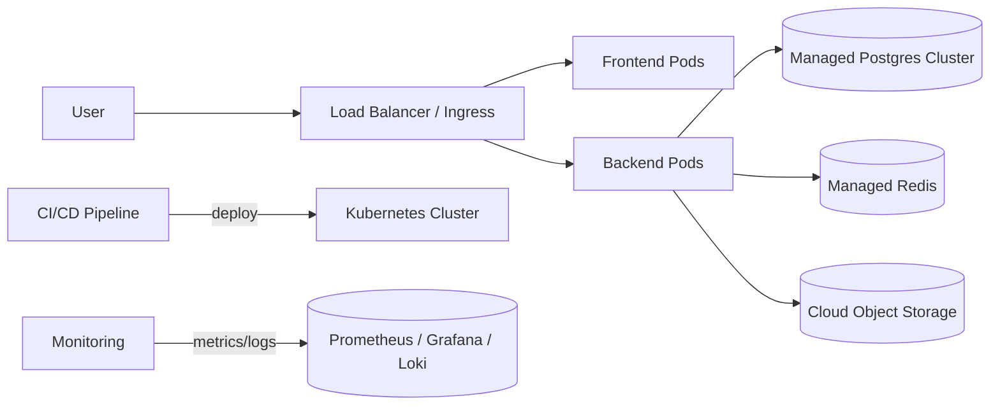

# System Overview
Generated: 2026-05-19T08:24:04.289100Z

## Executive Summary

This System Overview synthesizes information from 8 source document(s): Docs Inventory, docs_inventory.json, Github_errors.md, Documentation Inventory, models.data.json

## Key Components (auto-extracted)

- api (mentioned in 3 source(s))
- postgres (mentioned in 3 source(s))
- auth (mentioned in 3 source(s))
- frontend (mentioned in 2 source(s))
- backend (mentioned in 2 source(s))
- service (mentioned in 2 source(s))
- database (mentioned in 2 source(s))
- redis (mentioned in 2 source(s))
- queue (mentioned in 2 source(s))
- storage (mentioned in 2 source(s))
- fastapi (mentioned in 2 source(s))
- celery (mentioned in 1 source(s))

## Source Snippets

### Source: docs_inventory.md
Generated: 2026-05-19T08:14:05.417186Z

Top headings:
- Docs Inventory

### Source: docs_inventory.json
_No text preview available (binary or missing)_

### Source: audits/reports/Github_errors.md
mypy errors:

### Source: docs/generated/documentation_intelligence/docs_inventory.md
> Generated by `scripts/docs_inventory.py`. Do not edit manually.

Top headings:
- Documentation Inventory
- Summary
- Documents

### Source: .mypy_cache/3.12/fastapi/openapi/models.data.json
_No text preview available (binary or missing)_

### Source: docs/backlog/task_matrix_pr004.csv
_No text preview available (binary or missing)_

### Source: docs/compliance/task_matrix.csv
_No text preview available (binary or missing)_

### Source: docs/backlog/task_matrix_pr003.csv
_No text preview available (binary or missing)_

## Evidence & Sources

Referenced source documents:

- docs_inventory.md
- docs_inventory.json
- audits/reports/Github_errors.md
- docs/generated/documentation_intelligence/docs_inventory.md
- .mypy_cache/3.12/fastapi/openapi/models.data.json
- docs/backlog/task_matrix_pr004.csv
- docs/compliance/task_matrix.csv
- docs/backlog/task_matrix_pr003.csv

## Next Steps (recommendations)

- Validate this draft with product and tech leads
- Add architecture diagrams (deployment & logical)
- Create or link ADRs for major decisions
- Fill gaps identified in `docs_gap_report.md` and link evidence artifacts

## Architecture Diagrams

Below are starter diagrams (Mermaid) capturing a logical component view and a deployment view. These are intentionally high-level — please iterate during review.

### Logical Architecture (Mermaid)

```mermaid
graph TD
	User[User (Web / Mobile)] -->|HTTPS| CDN[CDN / Edge]
	CDN --> Frontend[Frontend (Next.js)]
	Frontend --> API[API Gateway / FastAPI]
	API --> Auth[Auth Service]
	API --> Services[Backend Services]
	Services --> Postgres[(Postgres)]
	Services --> Redis[(Redis cache)]
	Services --> Queue[(Task queue / Celery)]
	Services --> Storage[(Object storage)]
	Auth --> Postgres
	Services -->|events| EventBus[(Event Bus / pubsub)]
```

### Deployment Architecture (Mermaid)



Files with source infra to refine diagrams:

- `bicep/main.bicep`
- `bicep/container_apps.bicep`
- `k8s/`
- `docker-compose.yml`

## Linked ADRs

Key Architecture Decision Records relevant to this overview (add more links where appropriate):

- [0001 - Modular Monolith](../../docs/adr/0001-modular-monolith.md)
- [0003 - LLM Provider Abstraction](../../docs/adr/0003-llm-provider-abstraction.md)
- [0005 - FastAPI v2 Entrypoint](../../docs/adr/0005-fastapi-v2-entrypoint.md)
- [0006 - Next.js Frontend](../../docs/adr/0006-nextjs-frontend.md)
- [0007 - PostgreSQL Audit Ledger](../../docs/adr/0007-postgresql-audit-ledger.md)
- [0002 - POPIA First Design](../../docs/adr/0002-popia-first-design.md)
- [ADR-011 - Observability Stack](../../docs/adr/ADR-011-observability-stack.md)
- [ADR-013 - Backup / Restore / DR](../../docs/adr/ADR-013-backup-restore-disaster-recovery.md)
- [ADR-014 - Testing & Release Evidence Quality Gates](../../docs/adr/ADR-014-testing-release-evidence-quality-gates.md)
- [ADR-020 - Final Release Blocker Checklist](../../docs/adr/ADR-020-final-release-blocker-checklist.md)

If a decision mentioned in this overview lacks an ADR link, please add a short ADR under `docs/adr/` and ping the docs owner to include it here.

## Validation Checklist (for product & tech leads)

- [ ] Confirm the list of Key Components is complete and accurate.
- [ ] Validate ownership and responsibilities for each component.
- [ ] Review and correct the Logical and Deployment diagrams.
- [ ] Ensure ADRs cover major decisions; create ADRs for any missing decisions.
- [ ] Attach or link evidence artifacts (runbooks, infra manifests, release notes) for Production Readiness items.

## Proposed Evidence (quick mapping)

- System Overview sources: `docs_inventory.md`, `docs/generated/documentation_intelligence/docs_inventory.md`
- Deployment infra: `bicep/main.bicep`, `bicep/container_apps.bicep`, `k8s/`, `docker-compose.yml`
- Privacy & consent design: `docs/adr/0002-popia-first-design.md`
- Observability & backups: `docs/adr/ADR-011-observability-stack.md`, `docs/adr/ADR-013-backup-restore-disaster-recovery.md`
- Release readiness & testing evidence: `docs/adr/ADR-014-testing-release-evidence-quality-gates.md`, `docs/adr/ADR-020-final-release-blocker-checklist.md`

---

_Generated: 2026-05-19T08:40:00Z_